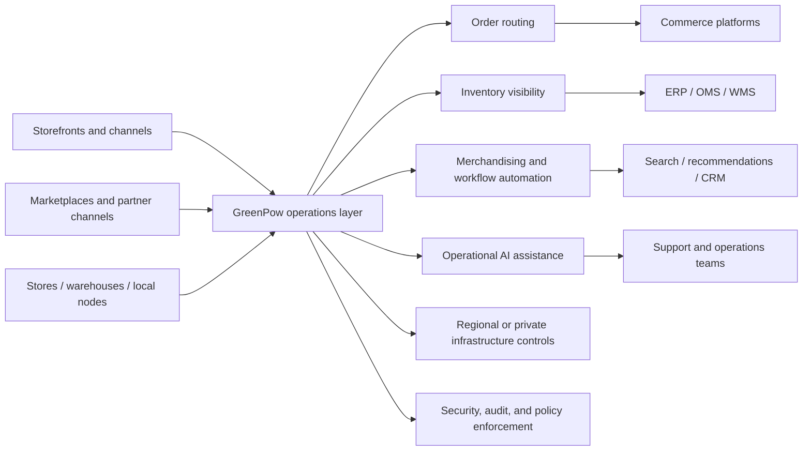

# GreenPow positioning for the e-commerce market

## Executive summary

GreenPow should position itself for e-commerce as **the infrastructure layer that makes growth predictable**. The market is already full of vendors promising AI, personalisation, unified commerce, and faster experiences. What modern e-commerce teams still struggle with is something more operational: keeping storefronts, order flows, inventory visibility, integrations, and regional deployments reliable as the business grows, while controlling cost and reducing the burden on internal teams. Shopify talks about future-proofing and resilience; Salesforce talks about faster time to value and lower TCO; Adobe talks about cloud-native scale and proactive monitoring; managed hosting vendors talk about “set it and forget it” infrastructure and lower total cost of ownership. That tells you what buyers are actually purchasing: **operational simplicity, predictability, and fewer surprises**. citeturn8view0turn8view2turn8view4turn11view0

The most commercially effective message is therefore **not** “AI-powered e-commerce infrastructure”. It is closer to: **“Run commerce operations on infrastructure you control.”** AI should appear as a supporting capability inside merchandising, order routing, support, and operational automation, because that is how the market already uses it. Salesforce positions AI around merchandising and guided shopping; Google positions AI around retail search, supply-chain optimisation, and store productivity; Klaviyo and Insider position AI around customer operations and orchestration. That means GreenPow should treat AI as an enabler of better commerce operations, not the headline category. citeturn8view2turn8view3turn8view6turn11view2turn11view3

The strongest strategic difference from traditional cloud providers is this: **AWS and Google sell infrastructure components and sovereignty options; GreenPow should sell a commerce operating outcome**. AWS gives you Outposts, sovereign cloud options, and retail building blocks. Google gives you Distributed Cloud, Spanner, sovereign controls, and retail tooling. But both still expect the customer to assemble those pieces into a usable operating model. GreenPow should present itself as the layer that turns raw infrastructure into a coherent commerce runtime for inventory, orders, merchandising, regional control, and operational automation. That is a meaningful difference, especially for operators who want fewer moving parts and more predictable execution. citeturn8view5turn8view6turn8view7turn5search1turn5search10

The best landing page angle is therefore **growth without infrastructure chaos**. In plain English, GreenPow helps online businesses scale without piling up more operational overhead, more cloud sprawl, or more dependency on a single vendor’s ecosystem. The biggest risks to avoid are sounding too abstract, too infrastructure-heavy, or too “AI-first”. Buyers need to understand in the first screen what operational mess GreenPow removes, why that matters commercially, and how the company reduces both firefighting and cost-of-complexity. Deloitte, KPMG, and the FinOps Foundation all point to the same context: retailers and digital businesses are under cost pressure, managing fragmented systems, and pursuing better efficiency, forecasting, and operational control. citeturn7view0turn7view1turn3search2turn7view3

## What e-commerce buyers actually worry about

Modern e-commerce operators do not think about infrastructure in abstract technical terms. They think about it through business symptoms: sites slowing down during peaks, promotions exposing database weaknesses, inventory not matching reality, too many add-ons and services to manage, cloud bills becoming harder to forecast, and new market launches turning into long integration projects. The strongest evidence for this comes from both the commerce vendors and the FinOps world. Shopify says enterprise leaders reconsider ecommerce platforms because of scalability and growing operational complexity; WooCommerce’s own scaling guidance says performance depends on traffic patterns, third-party code, hosting quality, and, at scale, investment in infrastructure and team support; FinOps says workload optimisation, waste reduction, cost allocation, and accurate forecasting are top priorities, with AI spend now being managed by most respondents. citeturn0search4turn7view4turn7view0

KPMG’s retail data work makes the operational problem even clearer. It says retailers are inundated with data yet struggle to turn it into action, and that fragmented organisations and data ecosystems make seamless commerce difficult. The same report says 54% of retail respondents reported at least a 10% increase in profit due to data and analytics, which means the upside is real, but only when the operating model is coherent enough to use the data properly. Deloitte’s 2026 retail outlook adds the commercial pressure: rising expectations for convenience and personalisation are colliding with persistent cost pressure and operational complexity. citeturn7view3turn3search2

This is why “predictable infrastructure” matters more than “advanced infrastructure”. Predictability means three things to buyers. First, **predictable performance**: no nasty surprises during launches, promotions, or peak periods. Second, **predictable operations**: less manual intervention, fewer brittle integrations, and clearer accountability when something goes wrong. Third, **predictable spend**: fewer unexplained cost spikes and better forecasting. FinOps explicitly says improved predictability and understanding of technology spend are now a major priority, while KPMG says cloud overspending often comes from insufficient oversight and weak governance. citeturn7view0turn7view1

The table below translates the market’s infrastructure concerns into the language buyers actually use. It synthesises official vendor positioning, analyst research, and official WooCommerce and managed-hosting materials. citeturn7view4turn11view0turn8view4turn8view3turn3search2turn7view1

| What buyers say | What they really mean | Why GreenPow should care |
|---|---|---|
| “We need to scale.” | We cannot afford checkout failures, slow pages, or broken back-office flows when demand spikes. | Lead with stable growth and peak resilience, not generic scalability. |
| “Our stack is getting messy.” | Too many plugins, services, clouds, and point tools are creating hidden operational overhead. | Position GreenPow as a simplifier of operating complexity. |
| “We need global reach.” | We want to launch in more regions without rebuilding our commerce stack every time. | Emphasise repeatable regional deployment and policy control. |
| “Cloud costs keep moving around.” | We do not have enough predictability, governance, or ownership over spend. | Tie infrastructure value to clearer control and cost discipline. |
| “We want to use AI.” | We want help with merchandising, support, routing, forecasting, and automation without introducing more risk. | Keep AI subordinate to operational outcomes. |
| “We already have a platform.” | We do not want a rip-and-replace transformation. | Sell GreenPow as an overlay or operating layer, not as a new religion. |

A particularly useful contrast is Shopify versus WooCommerce. Shopify’s enterprise message is simplicity, resilience, and modularity inside a managed platform; WooCommerce’s own documentation makes clear that scale is achievable, but it depends on hosting, caching, CDNs, plugin quality, order-storage optimisation, and often dedicated development effort. In other words, Shopify sells **managed predictability**, while WooCommerce often forces the merchant to construct predictability themselves. GreenPow can use this contrast by speaking to buyers who want more control than a locked platform provides, but less operational burden than a fully DIY stack creates. citeturn8view1turn7view4turn7view5

## How the market positions itself today

The market’s messaging patterns are remarkably consistent. Core commerce platforms sell scale, speed, unified operations, and lower complexity. Managed hosting companies sell operational relief, support, and lower TCO. Cloud providers sell flexibility, multicloud reach, and regional or sovereign options. Discovery and personalisation vendors sell conversion uplift, shopper relevance, and AI-led engagement. The result is a crowded front-end market and a relatively under-owned back-end positioning space. citeturn8view0turn8view2turn8view4turn11view0turn8view6turn9search0turn9search1turn10search0

The comparison below synthesises how the main competitor groups talk about commerce infrastructure, integration, and control. It is based on official product pages and documentation from the named vendors. citeturn8view0turn8view1turn8view2turn8view3turn8view4turn12search0turn12search1turn12search2turn9search7turn9search16turn9search13turn9search10turn10search0turn10search5turn10search2turn4search0turn5search0

| Vendor group | What they lead with | Integration posture | Trust / sovereignty posture | Strategic gap GreenPow can own |
|---|---|---|---|---|
| Shopify | Future-proofing, resilience, speed, modular enterprise components. | Strong within and around Shopify’s platform. | Strong on security/compliance, not on private or sovereign deployment control. | More control over runtime, data boundaries, and regional execution. |
| Salesforce Commerce Cloud | Unified commerce, order management, lower TCO, trusted AI. | Strong inside the Salesforce estate. | Strong trust language, but still a platform-centric operating model. | Cross-platform operational control and less single-vendor dependence. |
| Adobe Commerce | Cloud-native scale, proactive monitoring, hundreds of sites/brands, composable services. | Strong API and integration posture. | Strong compliance posture, shared-responsibility model, not a sovereign/private-cloud story. | Private or sovereign operations layer around commerce workflows. |
| commercetools / VTEX | Composability, APIs, unified commerce, marketplace and omnichannel strength. | Very strong integration posture. | More about flexibility and scale than sovereignty. | Reduce the operating burden of composable or marketplace-heavy estates. |
| Managed hosting | Speed, support, security, less operational overhead, lower TCO. | Limited mostly to the hosting layer. | Security and uptime are core, but little commerce-process ownership. | Move from “better hosting” to “better commerce operations”. |
| AWS / Google Cloud | Choice, services, retail solutions, edge/distributed cloud, sovereignty options. | Broadest technical flexibility. | Explicit sovereign options and security depth. | Commerce-native operating logic, not just cloud primitives. |
| Discovery / personalisation vendors | Search, recommendations, engagement, merchandising, AI assistants. | Designed to plug into existing stacks. | Some trust and governance language, little infrastructure ownership. | Govern the data plane and workflow layer underneath these tools. |

The strategic conclusion is that GreenPow should avoid copying the dominant phrasing already used by the market. “Unified commerce”, “AI-native commerce”, “faster innovation”, and “lower TCO” are all valid ideas, but they are already occupied. A more differentiated position is: **“the predictable operations layer for modern commerce”** or **“sovereign infrastructure for commerce operations”**. That frames GreenPow around a problem the market still feels but that few vendors own as a category. citeturn8view0turn8view2turn12search0turn12search1turn11view0turn8view7

## Where GreenPow can credibly win

GreenPow’s strongest position is not at the storefront layer and not at the raw cloud layer. It is in the middle: **the layer that turns infrastructure into reliable commerce operations**. That is where the company’s offering set fits best. Sovereign or private cloud matters because some buyers want control over region, access, and runtime. Distributed infrastructure and edge matter because some commerce processes benefit from local execution, survivability, or lower latency. Operational automation and AI orchestration matter because teams want to remove repetitive work from merchandising, service, routing, and inventory workflows. Privacy-first systems matter because data control increasingly shapes who buyers trust. The European Commission’s 2026 sovereign cloud procurement and Google and AWS sovereign-cloud offerings show that sovereignty is now an explicit market category, not just a technical footnote. citeturn6search0turn8view7turn4search5

The most important simplification GreenPow should make is this: **do not sell infrastructure features in isolation**. Translate each feature into an operating benefit. That aligns with how both cloud and managed hosting vendors already make infrastructure understandable to buyers. WP Engine talks about removing the burden of managing performance, security, and infrastructure internally; KPMG talks about embedding governance to control cloud cost and lower total cost of ownership; Google talks about modular architectures that allow retailers to ship updates faster and adapt more easily. citeturn11view0turn7view1turn8view6

The table below shows which parts of GreenPow’s offering are strongest for positioning and which should stay secondary. This is a strategic recommendation based on the market evidence above. citeturn11view0turn7view1turn8view6turn4search2turn6search0

| GreenPow capability | Best market framing | Why it works | What to avoid |
|---|---|---|---|
| Resilient infrastructure | **Keep commerce stable as you grow** | Reliability is a universal buyer concern. | Talking only about architecture patterns. |
| Operational automation | **Reduce manual work across orders, inventory, and merchandising** | Easy to connect to cost and speed. | Overclaiming “full autonomy”. |
| AI orchestration | **Use AI where it improves operations** | Keeps AI supportive and outcome-led. | Leading with “AI-first”. |
| Sovereign / private cloud | **Keep control of where commerce runs and where data lives** | Strong for enterprise and regulated buyers. | Treating sovereignty as relevant to every SMB. |
| Distributed infrastructure / edge | **Run local workflows where speed or survivability matters** | Strong when tied to stores, warehouses, or local nodes. | Making edge the headline for all buyers. |
| Privacy-first systems | **Protect customer and commerce data without slowing the business down** | Trust and compliance are now buying criteria. | Generic “secure by design” wording without proof. |
| Commerce agents | **Assist teams with routine commerce tasks** | Good supporting capability. | Front-page shopper-agent hype. |

GreenPow is also well placed to differentiate itself from traditional cloud providers. AWS and Google both offer serious infrastructure, retail solutions, multicloud tools, edge options, and sovereignty controls. But they still sell **capability building blocks**. GreenPow should sell **commerce predictability**: fewer systems to reconcile, clearer policies, faster operational changes, repeatable regional rollouts, and a better fit for inventory, order, and merchandising workflows. That is not “better infrastructure than AWS or Google”; it is **a better operating model for commerce on top of infrastructure**. This is a strategic inference from how hyperscalers describe their offerings and how buyers describe their problems. citeturn8view5turn8view6turn8view7turn7view1

## Messaging system for operators and founders

The best messaging structure for GreenPow is a four-step sequence.

First, state the **operational problem** in plain language: growth makes commerce harder to run. Second, explain **why infrastructure matters**: when the runtime, integrations, and regional controls are fragile, every launch, promotion, or expansion creates risk. Third, explain **what GreenPow changes**: it gives the business a controlled operations layer for orders, inventory, merchandising, and automation. Fourth, make the **business outcome** obvious: less firefighting, more predictable performance, lower overhead, easier expansion. That structure mirrors what successful competitors do: they move quickly from problem to value, and from value to proof. citeturn8view0turn8view2turn8view4turn11view0

A useful message pyramid for GreenPow looks like this:

- **Problem:** Your commerce stack gets harder to run as you add traffic, channels, markets, and tools.  
- **Stakes:** That creates slower launches, fragile operations, rising overhead, and harder-to-control spend.  
- **Solution:** GreenPow gives you a private, distributed, governed layer for running commerce operations reliably.  
- **Outcome:** Scale faster, operate with less complexity, and keep more control than generic cloud or vendor-managed platforms provide.  

That structure is commercially stronger than describing product components first, because buyers recognise the symptoms before they understand the architecture. The rationale is consistent with Shopify’s emphasis on resilience and resource efficiency, Salesforce’s emphasis on lower TCO and unified order flows, WP Engine’s emphasis on removing infrastructure burden, and KPMG’s emphasis on governance as the route to lower TCO. citeturn8view0turn8view2turn11view0turn7view1

The strongest landing-page angles are the following.

| Landing-page angle | Best-fit audience | Headline | Supporting line | CTA |
|---|---|---|---|---|
| Predictable growth | High-growth brands, Shopify Plus operators, scale-up ecommerce teams | **Scale without infrastructure surprises** | Keep storefronts, orders, and operational workflows stable as traffic, channels, and complexity grow. | **See the reference architecture** |
| Operational simplicity | Founders, heads of ecommerce, lean digital teams | **Run commerce, not cloud plumbing** | GreenPow reduces the burden of managing hosting, integrations, regional deployments, and operational automations. | **See how GreenPow reduces overhead** |
| Commerce control | Enterprise retailers, marketplaces, regulated businesses | **Run commerce operations on infrastructure you control** | Keep data, workflows, and regional execution inside boundaries you define. | **Assess your sovereignty fit** |
| Cost-of-complexity | CFO-influenced buyers, operations sponsors, digital transformation leaders | **Cut the cost of a fragmented commerce stack** | Replace hidden overhead, firefighting, and duplicated infrastructure work with a simpler operating layer. | **Model the ROI** |

For the hero section specifically, the headline should talk about an **outcome**, not a technology. Good options include:

**Run commerce operations on infrastructure you control**  
**Scale without infrastructure surprises**  
**Unify orders, inventory, and growth on a more predictable foundation**  
**The operations layer for modern commerce**  

Subheads should translate the offer into business language, for example:

**GreenPow gives online businesses a private, distributed infrastructure layer for reliable storefronts, order routing, inventory workflows, regional deployment, and governed automation.**  

**Use AI where it improves commerce operations—inside merchandising, support, and routing—without turning your stack into another black box.**

These are recommendations rather than factual claims, but they are built directly on the positioning patterns and buyer concerns documented above. citeturn8view3turn5search1turn7view1turn11view0

## Landing page architecture and reference diagram

The page should follow a simple logic: **problem, cost of inaction, solution, proof, conversion**. That is how infrastructure-heavy offers become understandable to operators and founders. Lead with commercial pain, not topology. Bring the architecture in only after the reader understands why the current stack is unpredictable or expensive to run. That sequence is consistent with how Shopify, Salesforce, Adobe, and managed hosting vendors frame their propositions: business value first, platform detail second. citeturn8view0turn8view2turn8view4turn11view0

A practical landing page outline for GreenPow should look like this:

| Section | What it should communicate | Evidence needed |
|---|---|---|
| Hero | Growth creates operational complexity; GreenPow restores predictability. | One scale, uptime, or deployment proof point. |
| The problem | Traffic spikes, plugin sprawl, fragmented systems, cloud unpredictability, and regional complexity drag growth down. | One simple “before” visual of a fragmented stack. |
| Why infrastructure matters | Reliability, spend control, and launch speed are infrastructure problems, not just app problems. | Short analyst proof strip on cost pressure, fragmentation, and predictability. |
| The GreenPow solution | A private, distributed operating layer for storefronts, orders, inventory, automation, and regional control. | Core architecture visual. |
| Key outcomes | Less operational overhead, more predictable scaling, cleaner global rollout, lower complexity cost. | Outcome callouts plus benchmark placeholders. |
| Use cases | Order routing, inventory workflows, merchandising support, marketplace ops, regional deployment, operational agents. | One workflow snapshot per use case. |
| Security and trust | Privacy-first controls, regional boundaries, auditability, compliance posture. | Compliance matrix and trust artefacts. |
| Integrations | Works with Shopify, Woo, Salesforce, Adobe, commercetools, VTEX, and core back-office systems. | Integration matrix and sample flows. |
| CTA | Architecture review, sovereignty review, or ROI assessment. | Low-friction form. |

A mermaid diagram that would work well for the page is below. It is designed to stay understandable to non-engineering buyers while still making the operating model concrete.

The architecture message beneath that diagram should be explicit: GreenPow is **not just hosting** and **not just another commerce application**. It is the layer that coordinates operational workflows across the existing stack, applies control and policy boundaries, and lets the business run centrally or regionally as needed. That design logic is aligned with Google Distributed Cloud, AWS Outposts, sovereign-control models, modern composable integration patterns, and analyst findings on fragmented retail operations. citeturn5search2turn8view5turn5search10turn8view7turn7view3

The evidence assets are non-negotiable. If GreenPow wants to be trusted as infrastructure rather than admired as a concept, the page needs a reference architecture, scalability benchmarks, recovery/failover explanation, integration examples, real security posture, and a simple ROI model. Adobe publishes scale claims and proactive monitoring. Shopify publishes enterprise-scale positioning and compliance artefacts. Google and AWS publish sovereignty and distributed-cloud materials. Buyers already expect this level of proof. citeturn8view4turn14search1turn14search0turn8view7turn4search5

## Objections, rebuttals and go-to-market recommendations

The strongest objections are predictable, and GreenPow should handle them directly on the page.

| Objection | What the buyer really means | Recommended rebuttal |
|---|---|---|
| “We already use Shopify.” | We do not want another platform decision. | GreenPow should be presented as an operating layer around the systems you already use, not a replacement for them. Shopify itself now supports modular enterprise components and existing-system integration. citeturn8view1 |
| “Why not AWS or Google Cloud?” | We assume hyperscalers cover this already. | AWS and Google provide strong infrastructure, sovereignty, and edge options, but they still leave the commerce operating model to the customer. GreenPow should position itself as the commerce-native layer on top. citeturn8view5turn8view6turn8view7 |
| “This sounds expensive.” | We fear a large transformation and unclear ROI. | Tie value to lower operational overhead, fewer manual fixes, less cloud waste, and faster launches. KPMG and FinOps both show governance and optimisation are central to lowering TCO and improving spend predictability. citeturn7view0turn7view1 |
| “Do we really need private or sovereign infrastructure?” | We are unsure whether control matters enough to pay for it. | Not every buyer needs sovereignty as the lead message. Use it selectively for multi-region, regulated, enterprise, or board-sensitive accounts; for others, lead with predictability and control, then introduce sovereignty as an option. citeturn6search0turn8view7 |
| “Can this scale globally?” | We need hard proof, not adjectives. | Answer with benchmarks, deployment patterns, and recovery design. Competitors already set the expectation for concrete proof. citeturn8view4turn0search17 |

The go-to-market implication is that GreenPow should not try to sell “infrastructure” in the abstract. It should sell **specific operating improvements** to three beachhead segments.

The first is **scaling Shopify and composable commerce teams** that want more control without taking on a fully DIY cloud burden. The second is **WooCommerce and custom-stack operators** who have already felt the pain of hosting, plugin, caching, and database complexity. The third is **enterprise retailers and marketplaces** that need regional control, stronger resilience, and cleaner operational orchestration across multiple systems. WooCommerce’s own scaling guidance and VTEX’s marketplace operational documentation both reinforce how real those operational problems are. citeturn7view4turn7view5turn12search2turn12search21

The land motion should be practical and proof-led. Instead of “Book a demo”, GreenPow will likely convert better with offers such as **See the reference architecture**, **Get an infrastructure review**, **Assess your commerce complexity**, or **Model your operating ROI**. That matches how infrastructure and enterprise platform buyers actually evaluate vendors: they want fit, proof, and implications for their existing estate before they want a polished tour. The market evidence from enterprise commerce platforms, managed hosting, and cloud cost governance all points in that direction. citeturn8view0turn11view0turn7view1

## Assumptions and open questions

This positioning recommendation assumes GreenPow can be deployed in a way that genuinely supports **private, regional, sovereign, or customer-controlled operating boundaries**. If GreenPow is in fact a standard multi-tenant hosted product with fixed deployment choices, the sovereignty angle should be narrowed significantly. citeturn8view7turn4search5turn6search2

It also assumes GreenPow is strongest in **operational workflows** such as order routing, inventory visibility, merchandising support, and regional execution rather than purely in shopper-facing experiences. If the product’s actual strength is mostly front-end personalisation or customer engagement, then the messaging should move closer to Bloomreach, Dynamic Yield, Insider, or Klaviyo territory, which is a much more crowded space. citeturn9search0turn10search0turn11view3turn11view2

Finally, this report assumes GreenPow does **not yet have a fully public proof set** equal to the best-known enterprise vendors’ benchmark and compliance disclosures. If GreenPow already has reliable numbers on throughput, uptime, recovery, deployment models, integration speed, or customer outcomes, those should move much higher in the landing-page design because infrastructure buyers trust evidence far more than elegant copy. citeturn8view4turn14search0turn14search1turn14search3