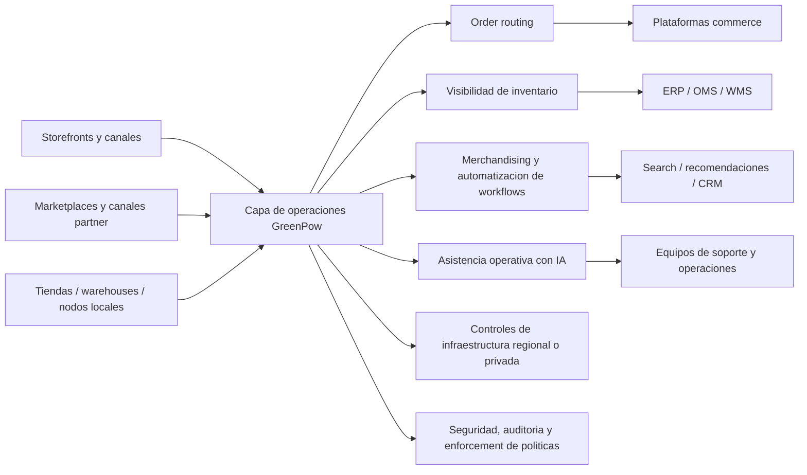

# Posicionamiento de GreenPow para el mercado e-commerce

## Resumen ejecutivo

GreenPow debe posicionarse para e-commerce como **la capa de infraestructura que hace que el crecimiento sea predecible**. El mercado ya esta lleno de vendors que prometen IA, personalizacion, unified commerce y experiencias mas rapidas. Lo que los equipos modernos de e-commerce siguen sufriendo es algo mas operativo: mantener storefronts, flujos de pedido, visibilidad de inventario, integraciones y despliegues regionales funcionando de forma fiable a medida que crece el negocio, mientras controlan coste y reducen carga sobre equipos internos.

Eso muestra lo que los compradores realmente adquieren: **simplicidad operativa, predictibilidad y menos sorpresas**.

El mensaje mas efectivo comercialmente no es "infraestructura e-commerce powered by AI". Es mas cercano a: **"Ejecuta operaciones commerce en infraestructura que controlas."** La IA debe aparecer como capacidad de apoyo dentro de merchandising, routing de pedidos, soporte y automatizacion operativa, porque asi la usa el mercado. GreenPow debe tratar la IA como habilitador de mejores operaciones commerce, no como categoria principal.

La diferencia estrategica frente a cloud providers tradicionales es esta: **AWS y Google venden componentes de infraestructura y opciones de soberania; GreenPow debe vender un resultado operativo commerce**. Los hyperscalers entregan bloques de construccion. GreenPow debe presentarse como la capa que convierte infraestructura bruta en un runtime commerce coherente para inventario, pedidos, merchandising, control regional y automatizacion operativa.

El mejor angulo de landing page es **crecimiento sin caos de infraestructura**. En lenguaje simple, GreenPow ayuda a negocios online a escalar sin acumular mas overhead operativo, mas sprawl cloud ni mas dependencia del ecosistema de un solo vendor. Los riesgos a evitar son sonar demasiado abstracto, demasiado infrastructure-heavy o demasiado "AI-first".

## Lo que preocupa realmente a compradores e-commerce

Los operadores e-commerce no piensan en infraestructura en terminos tecnicos abstractos. Piensan en sintomas de negocio: sitios lentos durante picos, promociones que exponen debilidades de base de datos, inventario que no coincide con la realidad, demasiados add-ons y servicios que gestionar, facturas cloud dificiles de predecir y lanzamientos en nuevos mercados que se convierten en proyectos largos de integracion.

Por eso "infraestructura predecible" importa mas que "infraestructura avanzada". Predictibilidad significa tres cosas para compradores:

- **Performance predecible:** sin sorpresas durante lanzamientos, promociones o temporadas pico.
- **Operaciones predecibles:** menos intervencion manual, menos integraciones fragiles y accountability mas clara cuando algo falla.
- **Gasto predecible:** menos picos inexplicables y mejor forecasting.

| Lo que dicen los compradores | Lo que realmente quieren decir | Por que GreenPow debe importarle |
|---|---|---|
| "Necesitamos escalar." | No podemos permitir fallos de checkout, paginas lentas o flujos back-office rotos cuando sube la demanda. | Liderar con crecimiento estable y resiliencia en picos, no escalabilidad generica. |
| "Nuestro stack se esta volviendo desordenado." | Demasiados plugins, servicios, clouds y herramientas crean overhead oculto. | Posicionar GreenPow como simplificador de complejidad operativa. |
| "Necesitamos alcance global." | Queremos lanzar en mas regiones sin reconstruir el stack cada vez. | Enfatizar despliegue regional repetible y control por politica. |
| "Los costes cloud se mueven demasiado." | No tenemos suficiente predictibilidad, gobierno o ownership sobre gasto. | Conectar valor de infraestructura con control y disciplina de costes. |
| "Queremos usar IA." | Queremos ayuda con merchandising, soporte, routing, forecasting y automatizacion sin introducir mas riesgo. | Mantener IA subordinada a outcomes operativos. |
| "Ya tenemos una plataforma." | No queremos un rip-and-replace. | Vender GreenPow como overlay o capa operativa, no como nueva religion. |

Una comparacion util es Shopify frente a WooCommerce. Shopify vende **predictibilidad gestionada**; WooCommerce puede escalar, pero a menudo obliga al merchant a construir la predictibilidad con hosting, caching, CDN, calidad de plugins, optimizacion de pedidos y esfuerzo de desarrollo. GreenPow puede hablar a compradores que quieren mas control que una plataforma cerrada, pero menos carga operativa que un stack totalmente DIY.

## Como se posiciona hoy el mercado

Los patrones de mensaje son consistentes. Las plataformas commerce venden escala, velocidad, operaciones unificadas y menor complejidad. Las empresas de managed hosting venden alivio operativo, soporte y menor TCO. Los cloud providers venden flexibilidad, alcance multicloud y opciones regionales o soberanas. Los vendors de discovery y personalizacion venden conversion, relevancia para shoppers y engagement con IA.

| Grupo vendor | Que lideran | Postura de integracion | Postura de confianza / soberania | Brecha que GreenPow puede ocupar |
|---|---|---|---|---|
| Shopify | Future-proofing, resiliencia, velocidad y componentes enterprise modulares. | Fuerte dentro y alrededor de Shopify. | Seguridad/compliance fuertes, pero no control de despliegue privado o soberano. | Mas control sobre runtime, limites de datos y ejecucion regional. |
| Salesforce Commerce Cloud | Unified commerce, order management, menor TCO e IA confiable. | Fuerte dentro del estate Salesforce. | Lenguaje trust fuerte, pero modelo operativo centrado en plataforma. | Control operativo cross-platform y menor dependencia single-vendor. |
| Adobe Commerce | Escala cloud-native, monitoring proactivo, multiples sitios y marcas, servicios composables. | Fuerte en APIs e integraciones. | Compliance fuerte, modelo de shared responsibility, no historia soberana/private-cloud. | Capa privada o soberana alrededor de workflows commerce. |
| commercetools / VTEX | Composabilidad, APIs, unified commerce, marketplace y omnichannel. | Muy fuerte. | Mas sobre flexibilidad y escala que soberania. | Reducir carga operativa de estates composables o marketplace-heavy. |
| Managed hosting | Velocidad, soporte, seguridad, menos overhead y menor TCO. | Limitado sobre todo al hosting. | Seguridad y uptime core, poca propiedad de procesos commerce. | Pasar de "mejor hosting" a "mejores operaciones commerce". |
| AWS / Google Cloud | Eleccion, servicios, retail solutions, edge/distributed cloud, opciones soberanas. | Flexibilidad tecnica amplia. | Opciones soberanas y profundidad de seguridad. | Logica operativa commerce-native, no solo cloud primitives. |
| Discovery / personalizacion | Search, recomendaciones, engagement, merchandising, AI assistants. | Pensado para conectarse a stacks existentes. | Algo de trust/governance, poca propiedad de infraestructura. | Gobernar data plane y workflow layer debajo de esas herramientas. |

La conclusion estrategica es que GreenPow debe evitar copiar frases ya ocupadas por el mercado. "Unified commerce", "AI-native commerce", "faster innovation" y "lower TCO" son ideas validas, pero saturadas. Una posicion mas diferenciada es: **"la capa de operaciones predecibles para commerce moderno"** o **"infraestructura soberana para operaciones commerce"**.

## Donde GreenPow puede ganar de forma creible

La posicion mas fuerte de GreenPow no esta en el storefront ni en raw cloud. Esta en medio: **la capa que convierte infraestructura en operaciones commerce fiables**.

La nube soberana o privada importa porque algunos compradores quieren control sobre region, acceso y runtime. La infraestructura distribuida y edge importa porque algunos procesos commerce se benefician de ejecucion local, supervivencia o menor latencia. La automatizacion operativa y orquestacion de IA importan porque los equipos quieren eliminar trabajo repetitivo de merchandising, servicio, routing e inventario. Los sistemas privacy-first importan porque el control de datos influye cada vez mas en la confianza.

La simplificacion mas importante: **no vender features de infraestructura de forma aislada**. Traducir cada feature en beneficio operativo.

| Capacidad GreenPow | Mejor framing de mercado | Por que funciona | Que evitar |
|---|---|---|---|
| Infraestructura resiliente | **Mantener commerce estable mientras creces** | La fiabilidad preocupa a todos. | Hablar solo de patrones arquitectonicos. |
| Automatizacion operativa | **Reducir trabajo manual en pedidos, inventario y merchandising** | Conecta con coste y velocidad. | Prometer "autonomia total". |
| Orquestacion de IA | **Usar IA donde mejora operaciones** | Mantiene IA como soporte orientado a outcome. | Liderar con "AI-first". |
| Cloud soberana / privada | **Mantener control sobre donde corre commerce y donde viven los datos** | Fuerte para compradores enterprise y regulados. | Tratar soberania como relevante para todos los SMB. |
| Infraestructura distribuida / edge | **Ejecutar workflows locales donde velocidad o supervivencia importan** | Fuerte con tiendas, warehouses o nodos locales. | Hacer de edge el titular para todos. |
| Sistemas privacy-first | **Proteger datos de cliente y commerce sin frenar el negocio** | Confianza y compliance ya son criterios de compra. | "Secure by design" generico sin prueba. |
| Agentes commerce | **Asistir a equipos con tareas commerce rutinarias** | Buen apoyo funcional. | Hype de shopper-agents en primera pantalla. |

GreenPow tambien puede diferenciarse de hyperscalers. AWS y Google venden **bloques de capacidad**. GreenPow debe vender **predictibilidad commerce**: menos sistemas que reconciliar, politicas mas claras, cambios operativos mas rapidos, despliegues regionales repetibles y mejor encaje con flujos de inventario, pedidos y merchandising.

## Sistema de mensaje para operadores y founders

La mejor estructura de mensaje tiene cuatro pasos:

1. Exponer el **problema operativo**: el crecimiento vuelve mas dificil operar commerce.
2. Explicar **por que la infraestructura importa**: cuando el runtime, las integraciones y los controles regionales son fragiles, cada lanzamiento, promocion o expansion crea riesgo.
3. Explicar **que cambia GreenPow**: da al negocio una capa de operaciones controlada para pedidos, inventario, merchandising y automatizacion.
4. Hacer obvio el **resultado de negocio**: menos firefighting, performance mas predecible, menor overhead y expansion mas facil.

Piramide de mensaje:

- **Problema:** tu stack commerce se vuelve mas dificil de operar cuando anades trafico, canales, mercados y herramientas.
- **Riesgo:** eso crea lanzamientos mas lentos, operaciones fragiles, overhead creciente y gasto mas dificil de controlar.
- **Solucion:** GreenPow te da una capa privada, distribuida y gobernada para ejecutar operaciones commerce de forma fiable.
- **Resultado:** escala mas rapido, opera con menos complejidad y conserva mas control que con cloud generica o plataformas completamente gestionadas.

| Angulo de landing | Audiencia | Titular | Linea de apoyo | CTA |
|---|---|---|---|---|
| Crecimiento predecible | Marcas de alto crecimiento, operadores Shopify Plus, equipos e-commerce scale-up | **Escala sin sorpresas de infraestructura** | Mantener storefronts, pedidos y workflows operativos estables mientras crecen trafico, canales y complejidad. | **Ver la arquitectura de referencia** |
| Simplicidad operativa | Founders, heads of ecommerce, equipos digitales lean | **Ejecuta commerce, no cloud plumbing** | GreenPow reduce la carga de gestionar hosting, integraciones, despliegues regionales y automatizaciones operativas. | **Ver como GreenPow reduce overhead** |
| Control commerce | Retailers enterprise, marketplaces, negocios regulados | **Ejecuta operaciones commerce en infraestructura que controlas** | Mantener datos, workflows y ejecucion regional dentro de limites definidos por ti. | **Evaluar encaje de soberania** |
| Coste de complejidad | CFOs, operaciones, transformacion digital | **Reduce el coste de un stack commerce fragmentado** | Sustituir overhead oculto, firefighting y trabajo duplicado de infraestructura por una capa operativa mas simple. | **Modelar el ROI** |

Titulares fuertes:

- **Ejecuta operaciones commerce en infraestructura que controlas**
- **Escala sin sorpresas de infraestructura**
- **Unifica pedidos, inventario y crecimiento sobre una base mas predecible**
- **La capa de operaciones para commerce moderno**

Subtitulos:

- **GreenPow da a negocios online una capa de infraestructura privada y distribuida para storefronts fiables, routing de pedidos, workflows de inventario, despliegue regional y automatizacion gobernada.**
- **Usa IA donde mejora operaciones commerce, dentro de merchandising, soporte y routing, sin convertir tu stack en otra caja negra.**

## Arquitectura de landing page y diagrama de referencia

La pagina debe seguir una logica simple: **problema, coste de inaccion, solucion, prueba, conversion**. Liderar con dolor comercial, no topologia. Traer la arquitectura solo despues de que el lector entienda por que el stack actual es impredecible o costoso de operar.

| Seccion | Que debe comunicar | Evidencia necesaria |
|---|---|---|
| Hero | El crecimiento crea complejidad operativa; GreenPow restaura predictibilidad. | Un proof point de escala, uptime o despliegue. |
| Problema | Picos de trafico, plugin sprawl, sistemas fragmentados, cloud impredecible y complejidad regional frenan crecimiento. | Visual simple "before" de stack fragmentado. |
| Por que importa la infraestructura | Fiabilidad, control de gasto y velocidad de lanzamiento son problemas de infraestructura, no solo de app. | Proof strip sobre presion de costes, fragmentacion y predictibilidad. |
| Solucion GreenPow | Capa operativa privada y distribuida para storefronts, pedidos, inventario, automatizacion y control regional. | Visual de arquitectura core. |
| Outcomes clave | Menos overhead, scaling mas predecible, rollout global mas limpio, menor coste de complejidad. | Callouts de outcome y placeholders de benchmark. |
| Casos de uso | Order routing, workflows de inventario, soporte de merchandising, operaciones marketplace, despliegue regional, agentes operativos. | Snapshot de workflow por caso. |
| Seguridad y confianza | Controles privacy-first, limites regionales, auditabilidad, postura de compliance. | Matriz compliance y trust assets. |
| Integraciones | Trabaja con Shopify, Woo, Salesforce, Adobe, commercetools, VTEX y sistemas back-office. | Matriz de integracion y flujos. |
| CTA | Revision de arquitectura, revision de soberania o assessment ROI. | Formulario de baja friccion. |

Diagrama sugerido:

El mensaje bajo el diagrama debe ser explicito: GreenPow **no es solo hosting** y **no es otra aplicacion commerce**. Es la capa que coordina workflows operativos entre el stack existente, aplica limites de control y politica, y permite que el negocio opere de forma centralizada o regional segun necesite.

Los activos de evidencia son obligatorios. La pagina necesita arquitectura de referencia, benchmarks de escalabilidad, explicacion de recovery/failover, ejemplos de integracion, postura real de seguridad y un modelo ROI simple.

## Objeciones, respuestas y recomendaciones GTM

| Objecion | Lo que realmente quiere decir el comprador | Respuesta recomendada |
|---|---|---|
| "Ya usamos Shopify." | No queremos otra decision de plataforma. | Presentar GreenPow como capa operativa alrededor de los sistemas existentes, no sustituto. |
| "Por que no AWS o Google Cloud?" | Asumimos que hyperscalers ya cubren esto. | AWS y Google dan infraestructura fuerte, soberania y edge; GreenPow debe posicionarse como la capa commerce-native encima. |
| "Suena caro." | Tememos una transformacion grande y ROI poco claro. | Conectar valor a menor overhead operativo, menos fixes manuales, menos desperdicio cloud y lanzamientos mas rapidos. |
| "Realmente necesitamos infraestructura privada o soberana?" | No sabemos si el control vale el coste. | Usar soberania selectivamente para cuentas multi-region, reguladas, enterprise o board-sensitive; para otras, liderar con predictibilidad y control. |
| "Puede escalar globalmente?" | Necesitamos prueba dura, no adjetivos. | Responder con benchmarks, patrones de despliegue y diseno de recovery. |

GreenPow no debe vender "infraestructura" en abstracto. Debe vender **mejoras operativas especificas** a tres beachheads:

- **Equipos Shopify y composable commerce en crecimiento** que quieren mas control sin una carga cloud totalmente DIY.
- **Operadores WooCommerce y custom-stack** que ya sintieron dolor de hosting, plugins, caching y complejidad de base de datos.
- **Retailers enterprise y marketplaces** que necesitan control regional, resiliencia fuerte y orquestacion operativa mas limpia entre sistemas.

La motion debe ser practica y proof-led. En lugar de "Book a demo", GreenPow probablemente convertira mejor con ofertas como **Ver la arquitectura de referencia**, **Recibir una revision de infraestructura**, **Evaluar la complejidad commerce** o **Modelar ROI operativo**.

## Supuestos y preguntas abiertas

Esta recomendacion asume que GreenPow puede desplegarse de forma que soporte de verdad **limites privados, regionales, soberanos o controlados por cliente**. Si GreenPow es en realidad un producto hosted multi-tenant con opciones fijas de despliegue, el angulo soberano debe estrecharse significativamente.

Tambien asume que GreenPow es mas fuerte en **workflows operativos** como order routing, visibilidad de inventario, soporte de merchandising y ejecucion regional que en experiencias shopper-facing. Si la fuerza real del producto esta sobre todo en personalizacion front-end o engagement de cliente, el mensaje deberia acercarse a Bloomreach, Dynamic Yield, Insider o Klaviyo, un espacio mucho mas saturado.

Por ultimo, este reporte asume que GreenPow aun no tiene un set publico de prueba igual al de los vendors enterprise mas conocidos. Si ya existen numeros confiables sobre throughput, uptime, recovery, modelos de despliegue, velocidad de integracion o outcomes de cliente, deben moverse mucho mas arriba en el diseno de la landing page.
