# Strategic research for GreenPow’s e-commerce infrastructure landing page

## Executive summary

The strategic opening for GreenPow is **not** “AI for e-commerce”. That category is already crowded. Shopify now pushes Sidekick inside its commerce admin; Salesforce has reframed Commerce Cloud as Agentforce Commerce with merchandising and guided shopping; Adobe positions Commerce as “built for the age of AI”; commercetools markets itself as an AI-first commerce platform; VTEX calls its suite AI-native; and the specialist layer is full of AI-led discovery and personalisation vendors such as Bloomreach, Coveo, Constructor, Dynamic Yield, Klaviyo, Google Cloud, and Amazon Personalize. A landing page that leads with “AI-powered ecommerce infrastructure” will therefore sound familiar rather than distinct. citeturn0search0turn0search1turn0search2turn0search3turn0search7turn2search3turn1search1turn2search4turn1search2turn2search18turn7search5turn7search6

Buyer urgency is real, but it is operational rather than cosmetic. Gartner says 91% of retail IT leaders are prioritising AI as the top technology to implement by 2026; Deloitte says retailers’ top growth opportunities include strengthening digital commerce, loyalty, and the omnichannel experience; KPMG’s retail data report says the central challenge is still breaking down silos, connecting insights to decisions, and building a data operating model that enables seamless commerce. In other words, retailers are under pressure to modernise rapidly, but the day-to-day pain still sits in fragmented data, disconnected operations, and rising complexity across channels. citeturn4search3turn4search2turn4search4

That gives GreenPow a sharper and more credible wedge: **position it as the sovereign, resilient operations layer for enterprise commerce**, not as another storefront or another AI assistant. Sovereignty is no longer a fringe concern. The European Commission has now awarded a sovereign cloud framework for EU institutions, while AWS and Google publicly market sovereign offerings with explicit controls around residency, operations, encryption, and personnel access. At the same time, McKinsey’s 2026 AI trust research shows that governance, risk, security, and inaccuracy remain major barriers to scaling AI and agentic systems. GreenPow’s strongest landing-page territory therefore sits at the intersection of commerce operations, infrastructure control, and trust. citeturn3search2turn3search11turn6search0turn6search4turn6search8turn3search1

The most commercially realistic ICP is **enterprise retailers, multi-brand groups, and marketplace operators** with enough scale that inventory, fulfilment, seller operations, regional data governance, and platform dependency have become management problems rather than purely technical ones. Those buyers do not need more AI rhetoric. They need proof that GreenPow can help them run inventory, orders, merchandising, and omnichannel coordination across existing platforms with more control, resilience, and policy enforcement. citeturn4search2turn10search1turn10search17turn8search11turn8search15

There are also real weaknesses GreenPow must address. “Private cloud”, “distributed infrastructure”, and “edge compute” can sound expensive or over-engineered unless they are tied to very concrete operational outcomes such as regional processing, store-level continuity, order-routing speed, or marketplace governance. Enterprise buyers will also expect hard proof: throughput benchmarks, failover behaviour, deployment models, integration patterns, audit trails, security posture, and compliance mappings. Competitors already set that standard: Shopify publishes enterprise-scale traffic numbers; Adobe publishes order-per-hour scale and compliance detail; ISO, SCC, and EU cyber rules define the trust baseline buyers increasingly expect. citeturn5search0turn5search1turn9search11turn6search1turn6search2turn6search3

**Recommended positioning:** lead with **commerce control, operational resilience, retailer independence, and sovereign data governance**, while treating AI as a supporting capability inside workflows, not the headline. citeturn4search4turn10search2turn3search1

## Market landscape focused on commerce operations

The market today splits into three practical layers. The first layer is the **core commerce platform**: Shopify, Salesforce, Adobe, commercetools, and VTEX. These vendors increasingly promise unified commerce, order management, APIs, composability, and AI support. The second layer is the **discovery, merchandising, and engagement layer**: Algolia, Bloomreach, Coveo, Constructor, Dynamic Yield, Insider, and Klaviyo. These vendors specialise in search, recommendations, experimentation, customer data unification, and journey orchestration. The third layer is **infrastructure and cloud**: AWS and Google Cloud, which offer the primitives for retail modernisation, edge-like deployment models, and now explicit sovereignty controls. GreenPow sits most naturally between layers one and three: above the raw cloud, but below shopper-facing apps. citeturn9search0turn0search1turn0search2turn0search3turn5search11turn1search4turn2search3turn1search1turn2search4turn1search2turn2search1turn2search18turn7search0turn7search1

### Core commerce and infrastructure competitors

| Vendor | Commerce infrastructure focus | Integration posture | Sovereignty and trust posture | Where GreenPow can win | Evidence |
|---|---|---|---|---|---|
| Shopify | Commerce Components is a modular packaging of Shopify’s infrastructure, APIs, services, and support for enterprise; Shopify also publishes enterprise-scale numbers including a 99.9% uptime SLA and very high peak traffic handling. | Strong: enterprise integrations and composable usage are supported through out-of-the-box components and third-party integrations. | Public messaging emphasises privacy tooling, GDPR help, and PCI DSS compliance, but not sovereign/private-cloud deployment. | Win where retailers want a **controlled runtime, regional policy boundaries, and operational orchestration around an existing Shopify estate** rather than more Shopify-native capability. | citeturn9search0turn5search0turn9search12turn9search1turn9search5 |
| Salesforce Commerce Cloud | Agentforce Commerce unifies ecommerce, POS, and order management on one platform. | Strong within the Salesforce estate; composable storefront and order-management integrations exist, and zero-copy is positioned as a way to avoid replication. | Public commerce messaging foregrounds a unified platform and trusted AI, not sovereign/private cloud. Zero-copy helps with data movement, but control still stays largely inside Salesforce’s operational model. | Win where buyers want **cross-platform control, retailer-owned governance, and fewer single-vendor dependencies**. | citeturn0search1turn8search0turn8search20turn9search2turn8search12 |
| Adobe Commerce | Adobe offers cloud-native scale, millions of products, 200K+ orders per hour, and cloud-service auto-scaling. | Strong: GraphQL, API Mesh, App Builder, and event-driven integration patterns are all explicit parts of the stack. | Adobe’s trust story is mature on compliance, with SOC 2 Type II, ISO/IEC 27001, PCI DSS, and GDPR support, but it is not a sovereign/private-cloud proposition in the public commerce messaging. | Win where buyers want **private or sovereign deployment boundaries, regional control, and distributed operations beyond Adobe-managed cloud scope**. | citeturn5search1turn5search17turn8search1turn8search21turn9search11 |
| commercetools | Strongest public stance on composable/API-first commerce among the core platform vendors. | Very strong: HTTP and GraphQL APIs, Import API, Subscriptions, API Extensions, and a growing integration marketplace. | Public materials foreground composability and flexibility rather than sovereignty. The trade-off is higher buyer-owned integration and operating complexity. | Win by offering a **governed operations layer that reduces composable-stack complexity while adding sovereignty and resilience controls**. | citeturn0search3turn8search10turn8search18turn8search22turn8search14 |
| VTEX | Native strength in unified commerce, marketplace, seller management, and OMS; explicitly supports inventory across stores and sellers. | Strong for marketplace and omnichannel operations, with seller portal, seller management, marketplace integrations, and OMS. | Public messaging foregrounds unified commerce and auto-scalable multi-tenant cloud, not sovereign/private-cloud control. | Win where operators need **retailer-controlled infrastructure, cross-platform governance, and independence from a vendor-managed multi-tenant core**. | citeturn5search11turn8search7turn8search11turn8search15turn5search3turn5search7 |
| AWS retail and Amazon Personalize | AWS offers broad retail infrastructure, supply-chain and merchandising tooling, Amazon Personalize for recommendations, Outposts for local compute, and a dedicated European Sovereign Cloud. | Broadest set of infrastructure primitives, but not a commerce-native control plane. | Strong explicit sovereignty posture for Europe and strong edge capabilities, but buyers still depend on a hyperscaler’s operational model and tooling. | Win by being **commerce-native and cloud-neutral**, especially where retailers want sovereignty plus workflow orchestration without full hyperscaler dependence. | citeturn7search0turn7search6turn7search8turn3search11 |
| Google Cloud retail and AI Commerce Search | Google promotes modular, microservices-based retail modernisation, Spanner for inventory and orders, Distributed Cloud for thousands of retail locations, and retail search/recommendation tooling. | Strong cloud and data posture; explicit support for distributed retail, AI Commerce Search, and data-centric retail use cases. | Strong explicit sovereignty story through Sovereign Cloud and Sovereign Controls by Partners, including residency, encryption, and personnel controls. | Win by offering a **retailer-owned commerce operations layer** on top of, or independent from, Google’s generic infrastructure. | citeturn1search3turn1search7turn7search3turn7search5turn7search9turn6search0turn6search4turn6search8 |

### Discovery, merchandising, and engagement competitors

| Vendor | Operational scope in commerce | Integration and data dependency | Trust and infrastructure gap | Where GreenPow can win | Evidence |
|---|---|---|---|---|---|
| Algolia | Search and recommendations for ecommerce. | Depends on being integrated into existing storefronts, catalogues, and data feeds. | Strong app-layer relevance; weak infrastructure or sovereignty proposition. | Win by providing the **governed data and runtime layer** underneath search and recommendation services. | citeturn1search4 |
| Bloomreach | Ecommerce search combines search, merchandising, recommendations, and SEO; Loomi combines product and customer data for personalisation. | Integration-heavy and data-dependent across channels and catalogues. | Strong discovery and personalisation, but not a private or sovereign infrastructure story. | Win by positioning GreenPow as the **control plane for data locality, integration governance, and resilient execution**. | citeturn2search3turn2search11turn1search0 |
| Coveo | Conversational product discovery, with an orchestration layer grounded in catalogue data and merchandising rules. | Integrates into search and catalogue layers rather than replacing core commerce infrastructure. | Strong trust angle on grounded responses, but still application-layer rather than infrastructure-layer. | Win by extending that trust concept down into **runtime control, audit, and regional execution**. | citeturn1search1turn1search17 |
| Constructor | Search, browse, recommendations, shopping agent, and merchant intelligence. | Depends on rich catalogue and behavioural data plus storefront integration. | Strong KPI-led discovery focus, but not a sovereignty or infrastructure-control proposition. | Win by connecting Constructor-like shopper intelligence to **governed back-end commerce operations**. | citeturn2search4turn2search8turn2search12 |
| Dynamic Yield | Personalisation and experimentation platform positioned as open, agile, and scalable. | Requires customer data, experience delivery, and experimentation pipelines. | Strong CX optimisation; limited infrastructure ownership narrative. | Win by owning the **privacy-first operational substrate** that such tools depend on. | citeturn1search2turn1search10 |
| Insider | CDP, personalisation, journey orchestration, AI-native capabilities, and 100+ integrations. | Strong orchestration and integration layer for marketers. | Strong engagement layer; weak commerce-infrastructure or sovereignty story. | Win by serving the **operational layer beneath journeys**, especially consent, events, order states, and regional controls. | citeturn2search1 |
| Klaviyo | B2C CRM and customer agent unifying marketing, service, analytics, and real-time signals. | Depends on connected customer data and commerce-event flows. | Strong lifecycle and service operation layer, but not infrastructure ownership. | Win by handling the **governed commerce event and data plane** that fuels service and lifecycle automation. | citeturn2search18turn2search2 |

The market implication is important: **the application layer is crowded, but the governed infrastructure layer is not**. Most competitors either own part of the experience stack or part of the cloud stack. Few publicly lead with a message about retailer-owned runtime, regional policy enforcement, distributed execution, and commerce-specific operational governance in one proposition. That is GreenPow’s white space. citeturn9search0turn8search20turn8search21turn8search10turn3search11turn6search8

## ICP and buyer matrix

GreenPow’s best-fit ICP is **enterprise retailers and marketplace operators with operational complexity, not generic merchants**. The strongest signal is a business that already has multiple systems, multiple channels, multiple fulfilment nodes, and some regional or governance pressure around customer and commerce data. KPMG’s retail data work points directly to fragmented ecosystems and the need for a data operating model; Deloitte points to omnichannel, digital commerce, and efficiency as top priorities; McKinsey’s omnichannel work emphasises the operational complexity created by multiple channels, multiple nodes, and decentralised inventory. citeturn4search4turn4search2turn10search9

This means GreenPow should target organisations where **commerce operations are already a strategic bottleneck**: multi-brand retailers, retailers with store-based fulfilment, sellers expanding into marketplace models, and operators exposed to regional data sensitivity or hyperscaler dependence. The landing page should therefore speak to both technical and operational leaders, not just one. citeturn10search2turn3search2turn3search11

### Buyer matrix

| Buyer | What they actually need | What they fear | What GreenPow must prove on-page | Why the urgency is real |
|---|---|---|---|---|
| CTO / CIO | Runtime control, integration sanity, resilience, region-aware deployment, and a way to modernise without another monolithic rebuild. | Vendor lock-in, uncontrolled data movement, brittle integrations, and weak failover under peak load. | Deployment model, integration model, audit model, region controls, scale benchmarks, and recovery behaviour. | Retail IT leaders are prioritising AI and modernisation, but Gartner also notes they must do more with fewer resources; hybrid modernisation pressure is high. citeturn4search3turn4search15 |
| Head of E-commerce / Omnichannel | Better order visibility, less channel friction, faster merchandising, and fewer customer experience failures. | Slow launches, inventory blind spots, fragmented customer journeys, and hidden operational costs. | Use-case proof around inventory visibility, order routing, merchandising latency, and channel coordination. | Deloitte identifies digital commerce, omnichannel, and loyalty as leading growth priorities for 2025. citeturn4search2 |
| Retail operations leadership | One-inventory logic, accurate stock, store-as-node fulfilment, and predictable operational workflows. | Stockouts, late fulfilment, poor routing, store-disconnect, and manual exception handling. | Proof of inventory consistency, order-routing rules, edge/offline continuity, and measurable productivity gains. | McKinsey and Google both emphasise central inventory truth and omnichannel decision-making across locations. citeturn10search1turn10search17turn1search7 |
| Marketplace operator / GM | Seller onboarding, catalogue quality, SLA control, and marketplace governance. | Seller sprawl, poor catalogue data, inconsistent fulfilment, and manual operator workload. | Seller workflow examples, governance rules, onboarding flows, catalogue controls, and order-handling controls. | VTEX’s own marketplace docs make clear that onboarding sellers, synchronising catalogues, and handling orders are persistent operational problems. citeturn8search11turn8search15turn5search15 |
| Transformation leader / COO / CFO sponsor | Reduced complexity cost, phased modernisation, and ROI that is not dependent on a full platform replacement. | Another long, expensive transformation programme without usable operating gains. | A phased adoption path, ROI assumptions, implementation scope, and evidence of cost avoidance or productivity uplift. | KPMG reports that 54% of retail respondents saw at least a 10% profit increase from data and analytics; buyers now expect measurable economics, not architecture theatre. citeturn4search13 |

A practical note: **CISO, privacy, or legal stakeholders are likely to be shadow decision-makers**, even if they are not the economic buyer. Sovereignty, SCCs, residency, and cyber resilience have moved high enough up the agenda that landing-page trust cues need to be visible before the sales process begins. citeturn3search2turn6search1turn6search2turn6search3

## Core problems and prioritised use cases

The market pain is not lack of tools; it is lack of coherence. KPMG’s retail report says retailers are trying to bridge the gap between data and impact and break down silos. Deloitte says retailers are trying to deliver more holistic, frictionless, personalised experiences. McKinsey says omnichannel operations increase complexity because they add channels, nodes, and decentralised inventory. Those three findings together explain why landing pages that speak about “AI-led experiences” alone often miss what enterprise operators actually care about. citeturn4search4turn4search2turn10search9

Operational automation belongs in the narrative, but it should be handled carefully. McKinsey notes that retailers pursue automation because of margin strain and higher customer expectations, yet automation maturity varies widely. GreenPow should therefore present automation as a way to reduce the cost of fragmented commerce operations, not as a promise of fully autonomous retail. citeturn10search3

### Prioritised use cases for the landing page

| Priority | Use case | Why this matters commercially | What GreenPow must show |
|---|---|---|---|
| Highest | Inventory visibility and allocation | Retailers need one-inventory logic and a high-performance, shared truth across online, in-store, distribution, and shipping contexts. This is one of the clearest operational pain points in omnichannel commerce. citeturn10search1turn1search7turn10search17 | Regional inventory architecture, consistency model, sync method, and examples of stock reservation, availability, and exception handling. |
| Highest | Order routing and fulfilment orchestration | Omnichannel speed and profitability depend on routing orders to the right node, using stores productively, and avoiding fulfilment fragmentation. citeturn10search17turn8search7turn10search2 | Routing rules, edge/site continuity, latency goals, queueing and replay behaviour, and KPI examples such as fewer split shipments or faster fulfilment. |
| High | Merchandising and search governance | Adobe, Bloomreach, Constructor, Salesforce, and others all signal that merchandising now depends on fast data and AI assistance; but merch teams still need control, rules, and auditability. citeturn0search2turn2search3turn2search12turn0search1 | Workflow examples showing AI-assisted recommendations, human approval, policy rules, and rollback or override controls. |
| High | Marketplace governance | Marketplace operations involve onboarding sellers, syncing catalogues, governing SLAs, and handling order and seller exceptions. This is concrete, high-friction work. citeturn8search11turn8search15turn5search15 | Seller lifecycle flows, catalogue governance, operational dashboards, and policy-based order and seller management. |
| High | Omnichannel orchestration | The connected store is an operating model, not a single product. Enterprise buyers need customer, associate, and back-office capabilities connected across channels and locations. citeturn10search2turn7search11 | Architecture that links channels, stores, warehouses, OMS/WMS/ERP, and policy-driven workflows. |
| Medium | Privacy-safe personalisation orchestration | Personalisation is a mature and crowded category. It matters, but it should not be the hero. Buyers will care more about data control and measurable outcomes than front-end AI novelty. citeturn7search9turn1search2turn2search11turn2search18 | Clear consent and residency boundaries, event flows, activation rules, and how GreenPow works with existing recommendation/search vendors. |
| Medium | Operational commerce agents | Customer agents and conversational discovery are increasingly common; GreenPow should frame agents around support, order status, approvals, or operator productivity rather than as a lead claim. citeturn2search2turn1search17turn0search0 | Guardrails, human hand-off, action permissions, audit trails, and policy-based orchestration examples. |
| Selective | Edge compute and store/warehouse continuity | Edge is valuable when it supports store analytics, local processing, fast checkout, or continuity in distributed operations; it is not, by itself, a category story. citeturn7search8turn7search3 | A precise explanation of where edge runs, why it runs there, and what happens under degraded connectivity or regional failover. |

The priority order matters. For enterprise operators, **inventory, fulfilment, and omnichannel coordination are stronger hooks than personalisation**. Personalisation is best treated as a downstream benefit of better governed commerce infrastructure, not the opening statement. citeturn4search2turn10search1turn7search9turn2search11

## Differentiation map and messaging matrix

GreenPow should avoid trying to out-market large vendors on claims they already own. It should not say “the best AI shopping experience”, “the most intelligent personalisation”, or “a unified commerce platform for every retailer”. Those territories are already occupied by the major platforms and specialists. Instead, GreenPow should say that **commerce operations become fragile when retailers do not control the runtime, policy boundaries, regional execution, data movement, or workflow orchestration underneath their commerce stack**. That is a sharper problem statement, and it is better supported by current market evidence about silos, omnichannel complexity, sovereignty, and trust. citeturn0search1turn0search2turn0search3turn2search3turn1search1turn4search4turn10search9turn3search2turn3search1

### Differentiation map

| Competing message in the market | Why it is weak for GreenPow | Better GreenPow position |
|---|---|---|
| “AI-powered e-commerce” | Saturated and non-differentiated; almost every serious vendor now makes this claim. | “Run commerce operations on infrastructure you control.” |
| “Better personalisation” | Crowded specialist category; hard to build trust without owning or governing the data plane. | “Govern customer, inventory, and order data where personalisation actually happens.” |
| “Unified commerce platform” | Sounds like a platform replacement, which raises switching-risk and budget resistance. | “Overlay control plane for the commerce systems you already use.” |
| “Headless/composable commerce” | Important but no longer distinctive on its own; composability can also increase integration burden. | “Composable execution with operational guardrails, sovereignty, and resilience.” |
| “Edge-first commerce” | Too technical and only relevant in some operating contexts. | “Run local workflows where latency, continuity, or residency actually matter.” |

### Messaging matrix

The copy below is strategically aligned to the market evidence above. It treats AI as supportive and keeps the narrative focused on e-commerce operations, trust, and control.

| Messaging layer | Recommended copy |
|---|---|
| Category statement | **Sovereign commerce infrastructure for enterprise operations** |
| Primary headline | **Run commerce operations on infrastructure you control** |
| Alternative headline | **Sovereign, resilient infrastructure for modern retail operations** |
| Alternative headline | **Unify inventory, orders, merchandising, and marketplaces without rebuilding your stack** |
| Subheadline | GreenPow gives enterprise retailers and marketplace operators a private, distributed operations layer for inventory, order routing, merchandising, omnichannel coordination, and governed automation. |
| Supporting line | Use AI where it improves commerce outcomes—inside inventory workflows, merchandising decisions, service operations, and routing logic—without handing over your runtime or your data plane. |
| Trust line | Keep customer and commerce data inside regional, policy-defined boundaries with auditable workflows and resilient execution. |
| Tagline options | **Control the runtime** · **Own the data plane** · **Scale without surrender** · **Retail operations under your rules** |
| CTA options | **See the reference architecture** · **Book an infrastructure review** · **Assess your sovereignty fit** · **Review integration options** |

These messages are stronger because they align with three observable truths in the market: platform saturation around AI claims, rising buyer pressure around omnichannel operations and efficiency, and growing demand for infrastructure trust and sovereignty. citeturn4search3turn4search2turn3search2turn3search1

## Landing page architecture and reference diagrams

A high-converting page for this category should move in a specific order: **complexity → control → credibility → outcome**. McKinsey’s AI trust work shows governance is still a blocker; KPMG’s retail work shows fragmentation remains central; and the leading vendors already train buyers to expect proof around scale, compliance, and architecture. GreenPow’s page should therefore be more like an executive infrastructure brief than a flashy AI microsite. citeturn3search1turn4search4turn5search0turn5search1turn9search11

### Recommended landing page structure

| Section | What it should say | What evidence asset it needs |
|---|---|---|
| Hero | Run commerce operations on infrastructure you control. | One simple scale or resilience proof point; one architecture preview visual. |
| Complexity / problem | Enterprise commerce is fragmented across platforms, channels, stores, sellers, and systems. | A “before” diagram showing disconnected storefront, OMS, WMS, ERP, CDP, marketplace, and store systems. |
| Why now | Omnichannel growth, margin pressure, fewer resources, and rising governance expectations make operational control urgent. | Short proof strip with analyst evidence and one-line takeaways. |
| Solution | GreenPow is the governed operations layer for inventory, merchandising, order routing, marketplace workflows, and omnichannel execution. | A layered architecture diagram showing control plane, data plane, integrations, and regional deployment. |
| Use cases | Highest-priority workflows: inventory, routing, merchandising, marketplace governance, omnichannel coordination. | One workflow visual per use case, each with a measurable business result. |
| Security, privacy, and sovereignty | Private or sovereign deployment options, residency controls, access controls, auditability, and compliance alignment. | Data residency map, deployment options diagram, access-control summary, compliance matrix. |
| Integrations | Works with existing commerce platforms and systems rather than requiring a rip-and-replace move. | Integration logos plus a technical integration matrix. |
| Proof and economics | Here is how GreenPow scales, recovers, and reduces complexity cost. | Benchmarks, incident/recovery posture, customer examples, ROI model assumptions. |
| CTA | Start with an architecture and sovereignty review. | Low-friction conversion form with architecture-review framing rather than generic “Book a demo”. |

### Suggested mermaid diagram for the solution section

Use a simplified version of the following as the page’s core architecture visual.

```mermaid
flowchart LR
    subgraph Channels["Commerce channels"]
        Web["Web / app storefronts"]
        POS["Store POS and associate tools"]
        Market["Marketplace channels"]
        Service["Service and support"]
    end

    subgraph Edge["Regional and edge runtime"]
        StoreEdge["Store / warehouse edge nodes"]
        Region["Regional private or sovereign cloud"]
    end

    subgraph Control["GreenPow control plane"]
        Policy["Policy, residency and access controls"]
        Orchestration["Workflow orchestration"]
        Agents["Operational commerce agents"]
        Audit["Audit, observability and recovery"]
    end

    subgraph Data["Governed commerce data plane"]
        Inventory["Inventory and availability"]
        Orders["Orders and fulfilment"]
        Merch["Catalogue and merchandising"]
        Customer["Customer, consent and identity events"]
    end

    subgraph Systems["Existing enterprise systems"]
        Platform["Shopify / SFCC / Adobe / commercetools / VTEX"]
        OMS["OMS / WMS / ERP"]
        Search["Search / recommendations / CRM"]
        Seller["Seller and marketplace systems"]
    end

    Web --> Region
    POS --> StoreEdge
    Market --> Region
    Service --> Region

    StoreEdge --> Control
    Region --> Control
    Control --> Data
    Data <--> Systems
    Policy --> Orchestration
    Policy --> Agents
    Audit --> Policy
```

### Sample reference architecture diagram guidance

For the final visual design, the architecture diagram should make five things visually obvious.

First, **GreenPow is an overlay and control plane**, not necessarily a full commerce-platform replacement. Second, **data and workflow boundaries are governed**, including residency and access. Third, **execution can happen centrally or locally**, depending on store, warehouse, or regional requirements. Fourth, **existing systems remain in place**. Fifth, **operational workflows are the centrepiece**, especially inventory, orders, merchandising, and marketplace operations. Those choices align with what buyers already see from composable enterprise commerce and with the current trust gap in AI and cloud adoption. citeturn9search0turn8search20turn8search21turn8search10turn3search1turn3search2

## Evidence, objections and go-to-market recommendations

Enterprise buyers will not accept abstract infrastructure claims in this category. The public standard is already visible in competitor materials: Shopify publishes traffic and BFCM scale, Adobe publishes order-rate scale and compliance posture, AWS and Google publish sovereignty and edge controls, and international standards define the baseline language of security and privacy assurance. GreenPow therefore needs to look provable from first click, not merely visionary. citeturn5search0turn5search1turn9search11turn3search11turn6search0turn6search1turn6search3

### Required technical proof points

| Proof point | Why it matters | Minimum artefact GreenPow should publish |
|---|---|---|
| Scalability | Buyers already see claims such as Shopify peak traffic handling and Adobe’s 200K+ orders/hour. | Peak throughput, p95 latency targets, concurrency assumptions, and a benchmark methodology. |
| Resilience | Commerce buyers fear peak-event failure and node or region outages more than they fear lack of features. | RTO/RPO targets, failover design, queueing and replay logic, degraded-connectivity behaviour for store or warehouse nodes. |
| Integration posture | Hybrid estates are normal; buyers want proof you coexist with incumbent platforms and back-office systems. | Supported connectors, API/event patterns, sync modes, and sample reference flows for Shopify/SFCC/Adobe/commercetools/VTEX plus ERP/WMS/OMS. |
| Sovereignty and privacy | “Sovereign” must mean more than hosting location. | Deployment models, residency map, access/personal controls, key-management model, SCC position, and tenant boundary explanation. |
| Security and compliance | Buyers need confidence, not broad reassurance. | Security white paper, audit logging model, identity and access controls, incident response summary, ISO/SOC roadmap or status, PCI scoping explanation where relevant. |
| Workflow credibility | The product must feel real in operations, not conceptual. | Step-by-step workflow examples for inventory allocation, order routing, merchandising approval, seller governance, and service escalation. |
| Economics | “Infrastructure” must convert into margin or productivity. | ROI assumptions by use case, baseline-to-target model, and sample business case. |

### Objections and rebuttals

| Objection | Recommended rebuttal |
|---|---|
| “We already use Shopify.” | That should lower, not raise, resistance. Shopify itself now sells modular Commerce Components and enterprise integrations. GreenPow should be presented as a **governed operations layer around the commerce stack you already run**, especially where regional control, marketplace complexity, or distributed operations sit outside Shopify’s core value. citeturn9search0turn9search12 |
| “This sounds expensive.” | The answer must be economic, not aspirational. Retailers are already under margin pressure and resource constraints, so GreenPow should frame its value as reducing the cost of fragmented operations, duplicated data movement, manual exceptions, and brittle integrations—ideally via phased adoption rather than a wholesale replatform. citeturn4search2turn4search15turn4search13 |
| “Why not AWS?” | AWS is an infrastructure giant with sovereign and edge options, but it is still a generic cloud foundation. GreenPow only wins if it shows a **commerce-native operational control plane** that can run on or alongside cloud infrastructure while preserving retailer policy control and workflow semantics. citeturn7search0turn7search8turn3search11 |
| “Can this scale globally?” | Buyers will compare you to published benchmarks. GreenPow should not answer with adjectives. It should answer with throughput, latency, failover, and multi-region deployment proof. That is now the market norm set by enterprise commerce vendors. citeturn5search0turn5search1turn5search17 |
| “How is customer data protected?” | Answer with architecture: residency boundaries, access controls, audit logs, encryption and key strategy, lawful transfer posture, and privacy controls. In Europe, SCCs, cyber resilience expectations, and sovereign-cloud procurement all reinforce that buyers want explicit governance language. citeturn6search1turn6search2turn3search2turn6search0 |

### Go-to-market recommendations

GreenPow should start with **enterprise retailers and marketplace operators in Europe and the UK**, especially those with multi-brand operations, store-based fulfilment, regional data-sensitivity concerns, or marketplace growth ambitions. The Europe angle is commercially valuable because sovereignty is becoming real procurement language, while omnichannel complexity and fragmented commerce operations remain acute operating problems. citeturn3search2turn4search4turn10search2

The best land motion is a **control-plane overlay**, not a platform replacement pitch. Buyers are already in hybrid estates. Shopify supports modular enterprise components, Salesforce supports composable storefront deployments, Adobe supports API Mesh and cloud-service integration, and commercetools is explicitly integration-heavy. GreenPow should therefore enter through a painful workflow—inventory visibility, order routing, or marketplace governance—then expand into broader orchestration and trust-led infrastructure territory. citeturn9search0turn8search20turn8search21turn8search10turn8search15

The page’s conversion offer should reflect that. A better conversion motion is **“See the reference architecture”**, **“Book an infrastructure review”**, or **“Assess your sovereignty fit”** rather than the generic “Book a demo”. These buyers want to assess fit, risk, and integration implications before they want a product tour. That is especially true in a market where trust maturity still lags deployment ambition. citeturn3search1turn4search3

From an economic perspective, GreenPow should model value around **reduced operational complexity** rather than only revenue uplift. KPMG reports strong profit impact from better data and analytics, Bain reports meaningful return-on-ad-spend gains from effective personalisation, and McKinsey highlights inventory productivity and speed advantages in omnichannel fulfilment. For GreenPow, the strongest ROI narrative is likely to be a blend of lower complexity cost, better routing and inventory outcomes, and selectively improved customer experience—not a promise of magical uplift from AI alone. citeturn4search13turn10search0turn10search17

## Assumptions and open questions

This report makes several explicit assumptions because GreenPow’s exact operating model was not provided.

It assumes GreenPow can be deployed in a **private, sovereign, or regionally segmented environment** and that it can sit **around** existing commerce platforms rather than requiring a full replacement. If GreenPow is actually a fully hosted multi-tenant application with limited deployment flexibility, the sovereignty position would need to be narrowed considerably.

It assumes GreenPow’s strongest use cases are **inventory, order routing, merchandising governance, omnichannel orchestration, and marketplace operations**, and that AI is used as a supporting workflow capability rather than the lead product category. If GreenPow’s real product strength is primarily shopper-facing AI or marketing automation, the competitor and messaging set would need to shift.

It assumes GreenPow does **not yet have a fully public evidence base** comparable to Shopify’s scale proofs, Adobe’s compliance disclosures, or hyperscaler sovereignty documentation. If GreenPow already has hard proof on benchmarks, deployments, security posture, or customer results, the landing page should elevate those aggressively.

It also assumes pricing has not yet been fixed publicly. That means the page should avoid broad cost claims and instead use **phased ROI language**, architecture-fit language, and workflow-specific value assumptions until pricing, packaging, and proof can be paired more precisely.