# Investigacion estrategica para la landing page de infraestructura e-commerce de GreenPow

## Resumen ejecutivo

La apertura estrategica para GreenPow **no** es "IA para e-commerce". Esa categoria ya esta saturada. Shopify empuja Sidekick dentro de su admin de commerce; Salesforce reformulo Commerce Cloud como Agentforce Commerce con merchandising y guided shopping; Adobe posiciona Commerce como "built for the age of AI"; commercetools se presenta como plataforma commerce AI-first; VTEX llama a su suite AI-native; y la capa especializada esta llena de vendors de descubrimiento y personalizacion con IA como Bloomreach, Coveo, Constructor, Dynamic Yield, Klaviyo, Google Cloud y Amazon Personalize. Una landing que lidere con "infraestructura ecommerce powered by AI" sonara familiar, no distinta.

La urgencia del comprador es real, pero operativa mas que cosmetica. Gartner dice que el 91% de lideres IT retail priorizan IA como tecnologia principal a implementar antes de 2026; Deloitte dice que las principales oportunidades de crecimiento para retailers incluyen fortalecer digital commerce, loyalty y experiencia omnichannel; KPMG senala que el desafio central sigue siendo romper silos, conectar insights con decisiones y construir un operating model de datos que habilite comercio sin friccion. En otras palabras, los retailers tienen presion para modernizarse rapido, pero el dolor diario sigue en datos fragmentados, operaciones desconectadas y complejidad creciente entre canales.

Eso da a GreenPow una cuna mas aguda y creible: **posicionarse como la capa soberana y resiliente de operaciones para commerce enterprise**, no como otro storefront ni otro asistente de IA. La soberania ya no es una preocupacion marginal. La Comision Europea adjudico un framework de cloud soberana para instituciones de la UE, mientras AWS y Google comercializan ofertas soberanas con controles explicitos sobre residencia, operaciones, cifrado y acceso de personal. Al mismo tiempo, la investigacion de McKinsey sobre confianza en IA muestra que gobierno, riesgo, seguridad e inexactitud siguen siendo barreras importantes para escalar IA y sistemas agenticos. El territorio mas fuerte de GreenPow esta en la interseccion de operaciones commerce, control de infraestructura y confianza.

El ICP comercialmente mas realista son **retailers enterprise, grupos multimarcas y operadores de marketplace** con suficiente escala para que inventario, fulfilment, operaciones de sellers, gobierno regional de datos y dependencia de plataforma sean problemas de gestion, no solo tecnicos. Esos compradores no necesitan mas retorica de IA. Necesitan prueba de que GreenPow puede ayudar a ejecutar inventario, pedidos, merchandising y coordinacion omnichannel entre plataformas existentes con mas control, resiliencia y enforcement de politicas.

Tambien hay debilidades reales que GreenPow debe abordar. "Private cloud", "distributed infrastructure" y "edge compute" pueden sonar caros o sobredisenados si no se atan a outcomes concretos: procesamiento regional, continuidad en tienda, velocidad de order routing o gobierno de marketplace. Los compradores enterprise esperaran pruebas duras: throughput, comportamiento de failover, modelos de despliegue, patrones de integracion, auditoria, postura de seguridad y mapeos de compliance. Los competidores ya establecen ese estandar con numeros de escala, detalle de compliance y controles soberanos.

**Posicionamiento recomendado:** liderar con **control de commerce, resiliencia operativa, independencia del retailer y gobierno soberano de datos**, tratando IA como capacidad de apoyo dentro de flujos, no como titular.

## Panorama de mercado centrado en operaciones commerce

El mercado se divide en tres capas practicas. La primera es la **plataforma commerce core**: Shopify, Salesforce, Adobe, commercetools y VTEX. Estos vendors prometen cada vez mas unified commerce, order management, APIs, composabilidad y soporte de IA. La segunda es la **capa de descubrimiento, merchandising y engagement**: Algolia, Bloomreach, Coveo, Constructor, Dynamic Yield, Insider y Klaviyo. Estos vendors se especializan en busqueda, recomendaciones, experimentacion, unificacion de datos de cliente y journey orchestration. La tercera es **infraestructura y cloud**: AWS y Google Cloud, que ofrecen primitives para modernizacion retail, modelos edge-like y controles explicitos de soberania. GreenPow encaja de forma natural entre las capas uno y tres: por encima del raw cloud, pero por debajo de apps shopper-facing.

### Competidores core de commerce e infraestructura

| Vendor | Foco de infraestructura commerce | Postura de integracion | Postura de soberania y confianza | Donde GreenPow puede ganar |
|---|---|---|---|---|
| Shopify | Commerce Components empaqueta infraestructura, APIs, servicios y soporte para enterprise; tambien publica pruebas de escala y SLA. | Fuerte: integraciones enterprise y uso composable. | Privacidad, GDPR y PCI, pero no despliegue privado/soberano. | Donde retailers quieren runtime controlado, limites regionales de politicas y orquestacion operacional alrededor de Shopify. |
| Salesforce Commerce Cloud | Agentforce Commerce unifica ecommerce, POS y order management. | Fuerte dentro del estate Salesforce; storefront composable y order management. | Trusted AI y plataforma unificada, no cloud privada/soberana. | Donde compradores quieren control cross-platform, gobierno propio y menos dependencia single-vendor. |
| Adobe Commerce | Escala cloud-native, millones de productos, alto volumen de pedidos y auto-scaling. | Fuerte: GraphQL, API Mesh, App Builder y eventos. | Compliance maduro, pero no proposicion soberana/private-cloud publica. | Donde compradores necesitan limites privados o soberanos, control regional y operaciones distribuidas. |
| commercetools | Posicion API-first/composable muy fuerte. | Muy fuerte: APIs, Import API, Subscriptions, API Extensions e integraciones. | Flexibilidad y composabilidad mas que soberania. | Reducir complejidad de stack composable con guardrails operativos, soberania y resiliencia. |
| VTEX | Unified commerce, marketplace, seller management y OMS. | Fuerte para marketplace y omnichannel. | Multi-tenant cloud y unified commerce, no control privado/soberano. | Donde operadores necesitan infraestructura controlada por retailer, gobierno cross-platform e independencia. |
| AWS retail / Amazon Personalize | Infraestructura retail amplia, supply-chain, merchandising, Outposts y European Sovereign Cloud. | Amplias primitives, pero no plano de control commerce-native. | Postura soberana europea fuerte, pero bajo modelo hyperscaler. | Ser commerce-native y cloud-neutral, especialmente con soberania + orquestacion workflow sin dependencia total hyperscaler. |
| Google Cloud retail / AI Commerce Search | Modernizacion retail modular, Spanner para inventario/pedidos, Distributed Cloud y tooling retail AI. | Fuerte postura cloud y datos. | Sovereign Cloud y controles por partners. | Ofrecer una capa de operaciones commerce propiedad del retailer sobre o independiente de Google. |

### Competidores de descubrimiento, merchandising y engagement

| Vendor | Alcance operativo en commerce | Dependencia de integracion/datos | Brecha de confianza e infraestructura | Donde GreenPow puede ganar |
|---|---|---|---|---|
| Algolia | Busqueda y recomendaciones ecommerce. | Depende de storefronts, catalogos y feeds. | Relevancia app-layer; poca soberania/infraestructura. | Capa gobernada de datos y runtime debajo de search/recommendations. |
| Bloomreach | Search, merchandising, recomendaciones, SEO y Loomi. | Integracion y datos intensivos entre canales. | Fuerte en discovery; no historia de infraestructura privada/soberana. | Control plane para localidad de datos, gobierno de integracion y ejecucion resiliente. |
| Coveo | Descubrimiento conversacional con orquestacion anclada en catalogo y reglas. | Integra capas de search/catalogo. | Trust en respuestas grounded, pero capa aplicacion. | Extender confianza a control runtime, auditoria y ejecucion regional. |
| Constructor | Search, browse, recomendaciones, shopping agent e inteligencia merchant. | Requiere catalogo y comportamiento. | Foco KPI de discovery, no infraestructura. | Conectar shopper intelligence con operaciones commerce back-end gobernadas. |
| Dynamic Yield | Personalizacion y experimentacion. | Requiere datos de cliente y delivery de experiencias. | CX fuerte; narrativa limitada de infraestructura. | Substrato operacional privacy-first que alimenta esas herramientas. |
| Insider | CDP, personalizacion, journey orchestration e integraciones. | Orquestacion marketing. | Engagement layer fuerte; no infraestructura commerce. | Capa operacional debajo de journeys: consentimiento, eventos, estados de pedido, controles regionales. |
| Klaviyo | CRM B2C, customer agent, marketing, servicio, analitica y senales real-time. | Depende de datos y eventos conectados. | Lifecycle/service layer; no propiedad de infraestructura. | Data plane y event plane de commerce gobernados. |

La implicacion de mercado es importante: **la capa de aplicacion esta saturada, pero la capa de infraestructura gobernada no**. La mayoria de competidores posee parte del experience stack o del cloud stack. Pocos lideran publicamente con runtime propiedad del retailer, enforcement regional de politicas, ejecucion distribuida y gobierno operacional especifico de commerce en una sola propuesta. Ese es el white space de GreenPow.

## ICP y matriz de compradores

El mejor ICP son **retailers enterprise y operadores de marketplace con complejidad operativa**, no merchants genericos. La senal mas fuerte es un negocio que ya tiene multiples sistemas, multiples canales, multiples nodos de fulfilment y alguna presion regional o de gobierno sobre datos de cliente y commerce. KPMG apunta a ecosistemas fragmentados y necesidad de un operating model de datos; Deloitte apunta a omnichannel, digital commerce y eficiencia; McKinsey enfatiza la complejidad operacional creada por multiples canales, nodos e inventario descentralizado.

GreenPow debe apuntar a organizaciones donde **las operaciones commerce ya son un cuello de botella estrategico**: retailers multimarcas, retailers con fulfilment desde tienda, sellers que evolucionan a marketplace y operadores expuestos a sensibilidad regional de datos o dependencia hyperscaler. La landing debe hablar tanto a lideres tecnicos como operativos.

### Matriz de compradores

| Comprador | Que necesita | Que teme | Que debe probar GreenPow en pagina | Por que la urgencia es real |
|---|---|---|---|---|
| CTO / CIO | Control de runtime, integracion sensata, resiliencia, despliegue regional y modernizacion sin rebuild monolitico. | Lock-in, movimiento de datos sin control, integraciones fragiles y failover debil en picos. | Modelo de despliegue, integracion, auditoria, controles regionales, benchmarks y recovery. | Retail IT prioriza IA y modernizacion con menos recursos. |
| Head of E-commerce / Omnichannel | Mejor visibilidad de pedidos, menos friccion entre canales, merchandising mas rapido y menos fallos CX. | Lanzamientos lentos, inventario ciego, journeys fragmentados y costes ocultos. | Pruebas de inventario, routing, merchandising y coordinacion de canales. | Digital commerce, omnichannel y loyalty son prioridades de crecimiento. |
| Operaciones retail | Logica de inventario unico, stock preciso, tiendas como nodos y workflows previsibles. | Stockouts, fulfilment tardio, routing pobre, desconexion de tienda y excepciones manuales. | Consistencia de inventario, reglas de routing, continuidad edge/offline y productividad. | Omnichannel exige verdad central de inventario y decisiones entre ubicaciones. |
| Operador marketplace / GM | Onboarding de sellers, calidad de catalogo, control de SLAs y gobierno marketplace. | Sprawl de sellers, datos de catalogo pobres, fulfilment inconsistente y carga manual. | Flujos de seller, reglas de gobierno, catalogo y order handling. | Onboarding, sincronizacion y excepciones son problemas persistentes. |
| Transformacion / COO / CFO | Menor coste de complejidad, modernizacion por fases y ROI sin replatform total. | Otro programa largo y caro sin ganancias operativas. | Ruta de adopcion, supuestos ROI y alcance de implementacion. | Los compradores esperan economia medible, no teatro arquitectonico. |

CISO, privacidad y legal seran decision-makers en sombra aunque no sean compradores economicos. Soberania, SCCs, residencia y resiliencia cyber ya estan lo bastante arriba en la agenda como para que las senales de confianza aparezcan antes del proceso de ventas.

## Problemas centrales y casos de uso priorizados

El dolor de mercado no es falta de herramientas; es falta de coherencia. KPMG dice que los retailers intentan cerrar la brecha entre datos e impacto y romper silos. Deloitte dice que quieren experiencias mas holisticas, sin friccion y personalizadas. McKinsey dice que omnichannel aumenta complejidad porque suma canales, nodos e inventario descentralizado. Juntas, estas conclusiones explican por que las landing centradas solo en "experiencias con IA" suelen fallar: los operadores enterprise se preocupan por coordinacion, datos y resiliencia.

La automatizacion operativa pertenece a la narrativa, pero debe manejarse con cuidado. Retailers la buscan por presion de margenes y mayores expectativas de cliente, pero la madurez varia. GreenPow debe presentar automatizacion como forma de reducir el coste de operaciones commerce fragmentadas, no como promesa de retail totalmente autonomo.

### Casos de uso para la landing

| Prioridad | Caso de uso | Por que importa | Que debe mostrar GreenPow |
|---|---|---|---|
| Maxima | Visibilidad y asignacion de inventario | Los retailers necesitan logica de inventario unico y verdad compartida entre online, tienda, distribucion y envio. | Arquitectura regional de inventario, modelo de consistencia, sync, reserva de stock, disponibilidad y excepciones. |
| Maxima | Order routing y fulfilment orchestration | Velocidad y rentabilidad omnichannel dependen de enrutar pedidos al nodo correcto y evitar fragmentacion. | Reglas de routing, continuidad edge/site, objetivos de latencia, colas/replay y KPIs como menos split shipments. |
| Alta | Gobierno de merchandising y search | El merchandising depende de datos rapidos e IA asistida, pero los equipos necesitan control, reglas y auditoria. | Recomendaciones asistidas por IA, aprobacion humana, politicas, rollback y overrides. |
| Alta | Gobierno marketplace | Marketplaces implican onboarding, catalogos, SLAs y excepciones de seller/pedido. | Flujos de seller lifecycle, gobierno de catalogo, dashboards y reglas por politicas. |
| Alta | Orquestacion omnichannel | La tienda conectada es un modelo operativo, no un producto unico. | Arquitectura que conecta canales, tiendas, warehouses, OMS/WMS/ERP y workflows. |
| Media | Personalizacion privacy-safe | La personalizacion es madura y competida. Importa, pero no debe ser hero. | Consentimiento, residencia, event flows y convivencia con search/recommendation vendors. |
| Media | Agentes operativos commerce | Customer agents y discovery conversacional son comunes; GreenPow debe enfocarlos en soporte, pedidos, aprobaciones y productividad. | Guardrails, handoff humano, permisos de accion, auditoria y orquestacion por politicas. |
| Selectiva | Edge compute y continuidad tienda/warehouse | Edge vale cuando soporta analitica local, checkout rapido o continuidad. | Donde corre edge, por que, y que pasa con conectividad degradada o failover regional. |

El orden importa. Para operadores enterprise, **inventario, fulfilment y coordinacion omnichannel son hooks mas fuertes que personalizacion**. La personalizacion debe aparecer como beneficio downstream de mejor infraestructura commerce gobernada, no como apertura.

## Mapa de diferenciacion y matriz de mensaje

GreenPow debe evitar competir en claims que otros ya poseen. No debe decir "la mejor experiencia de compra con IA", "la personalizacion mas inteligente" o "una plataforma unified commerce para todo retailer". Esos territorios ya estan ocupados. En su lugar, GreenPow debe decir que **las operaciones commerce se vuelven fragiles cuando los retailers no controlan el runtime, los limites de politicas, la ejecucion regional, el movimiento de datos o la orquestacion de workflows debajo de su stack commerce**.

### Mapa de diferenciacion

| Mensaje de mercado | Por que es debil para GreenPow | Mejor posicion GreenPow |
|---|---|---|
| "AI-powered e-commerce" | Saturado y no diferenciado. | "Ejecuta operaciones commerce en infraestructura que controlas." |
| "Mejor personalizacion" | Categoria llena de especialistas. | "Gobierna datos de cliente, inventario y pedidos donde la personalizacion realmente ocurre." |
| "Unified commerce platform" | Suena a replacement y aumenta riesgo/budget resistance. | "Control plane overlay para sistemas commerce existentes." |
| "Headless/composable commerce" | Importante pero no distintivo; puede aumentar carga de integracion. | "Ejecucion composable con guardrails, soberania y resiliencia." |
| "Edge-first commerce" | Tecnico y solo relevante en algunos contextos. | "Ejecuta flujos locales donde latencia, continuidad o residencia importan." |

### Matriz de mensaje

| Capa | Copy recomendado |
|---|---|
| Categoria | **Infraestructura commerce soberana para operaciones enterprise** |
| Titular principal | **Ejecuta operaciones commerce en infraestructura que controlas** |
| Alternativo | **Infraestructura soberana y resiliente para operaciones retail modernas** |
| Alternativo | **Unifica inventario, pedidos, merchandising y marketplaces sin reconstruir tu stack** |
| Subtitulo | GreenPow ofrece a retailers enterprise y operadores marketplace una capa privada y distribuida de operaciones para inventario, order routing, merchandising, coordinacion omnichannel y automatizacion gobernada. |
| Linea de apoyo | Usa IA donde mejora outcomes commerce: inventario, decisiones de merchandising, operaciones de servicio y logica de routing, sin entregar tu runtime ni tu data plane. |
| Linea de confianza | Manten datos de cliente y commerce dentro de limites regionales definidos por politicas con workflows auditables y ejecucion resiliente. |
| Taglines | **Controla el runtime** - **Posee el data plane** - **Escala sin ceder control** - **Operaciones retail bajo tus reglas** |
| CTA | **Ver la arquitectura de referencia** - **Reservar revision de infraestructura** - **Evaluar encaje de soberania** - **Revisar opciones de integracion** |

Estos mensajes son mas fuertes porque se alinean con tres verdades observables: saturacion de claims de IA, presion creciente sobre omnichannel/eficiencia y demanda de confianza y soberania en infraestructura.

## Arquitectura de landing page y diagramas de referencia

Una pagina de alta conversion debe moverse en este orden: **complejidad -> control -> credibilidad -> outcome**. La confianza en IA sigue bloqueada por gobierno; el retail sigue fragmentado; y los principales vendors ya entrenan compradores para esperar prueba de escala, compliance y arquitectura. La pagina de GreenPow debe sentirse mas como un brief ejecutivo de infraestructura que como micrositio vistoso de IA.

### Estructura recomendada

| Seccion | Que debe decir | Activo de evidencia necesario |
|---|---|---|
| Hero | Ejecuta operaciones commerce en infraestructura que controlas. | Prueba simple de escala/resiliencia y preview arquitectonico. |
| Complejidad/problema | Commerce enterprise esta fragmentado entre plataformas, canales, tiendas, sellers y sistemas. | Diagrama before con storefront, OMS, WMS, ERP, CDP, marketplace y stores desconectados. |
| Por que ahora | Omnichannel, margenes, menos recursos y gobierno hacen urgente el control operacional. | Proof strip con evidencia analista y takeaway. |
| Solucion | GreenPow es capa de operaciones gobernada para inventario, merchandising, order routing, marketplace y omnichannel. | Arquitectura con control plane, data plane, integraciones y despliegue regional. |
| Casos de uso | Inventario, routing, merchandising, marketplace, omnichannel. | Visual workflow por caso y resultado medible. |
| Seguridad, privacidad y soberania | Despliegue privado/soberano, residencia, acceso, auditoria y compliance alignment. | Mapa de residencia, opciones de despliegue, resumen de acceso, matriz compliance. |
| Integraciones | Funciona con plataformas existentes sin rip-and-replace. | Logos + matriz tecnica de integraciones. |
| Prueba y economia | Como escala, se recupera y reduce coste de complejidad. | Benchmarks, recovery posture, ejemplos cliente, ROI assumptions. |
| CTA | Empezar con revision de arquitectura y soberania. | Formulario de baja friccion con framing de arquitectura, no "demo" generica. |

### Diagrama mermaid sugerido

```mermaid
flowchart LR
    subgraph Channels["Canales commerce"]
        Web["Web / app storefronts"]
        POS["Store POS y herramientas associate"]
        Market["Canales marketplace"]
        Service["Servicio y soporte"]
    end

    subgraph Edge["Runtime regional y edge"]
        StoreEdge["Nodos edge de tienda / warehouse"]
        Region["Cloud privada o soberana regional"]
    end

    subgraph Control["Plano de control GreenPow"]
        Policy["Politicas, residencia y acceso"]
        Orchestration["Orquestacion de workflows"]
        Agents["Agentes operativos commerce"]
        Audit["Auditoria, observabilidad y recovery"]
    end

    subgraph Data["Data plane commerce gobernado"]
        Inventory["Inventario y disponibilidad"]
        Orders["Pedidos y fulfilment"]
        Merch["Catalogo y merchandising"]
        Customer["Eventos de cliente, consentimiento e identidad"]
    end

    subgraph Systems["Sistemas enterprise existentes"]
        Platform["Shopify / SFCC / Adobe / commercetools / VTEX"]
        OMS["OMS / WMS / ERP"]
        Search["Search / recomendaciones / CRM"]
        Seller["Sistemas seller y marketplace"]
    end

    Web --> Region
    POS --> StoreEdge
    Market --> Region
    Service --> Region

    StoreEdge --> Control
    Region --> Control
    Control --> Data
    Data <--> Systems
    Policy --> Orchestration
    Policy --> Agents
    Audit --> Policy
```

### Guia para visual de arquitectura

El diagrama final debe hacer obvias cinco cosas. Primero, **GreenPow es overlay y control plane**, no necesariamente reemplazo de plataforma commerce. Segundo, **los limites de datos y workflows estan gobernados**, incluida residencia y acceso. Tercero, **la ejecucion puede ocurrir centralmente o localmente**, segun tienda, warehouse o requisitos regionales. Cuarto, **los sistemas existentes permanecen**. Quinto, **los workflows operativos son el centro**, especialmente inventario, pedidos, merchandising y operaciones marketplace.

## Evidencia, objeciones y recomendaciones go-to-market

Los compradores enterprise no aceptaran claims abstractos de infraestructura. El estandar publico ya esta visible: Shopify publica escala, Adobe publica volumen de pedidos y compliance, AWS y Google publican controles soberanos y edge, y estandares internacionales definen el lenguaje base de assurance. GreenPow debe parecer comprobable desde el primer clic, no solo visionario.

### Pruebas tecnicas requeridas

| Prueba | Por que importa | Artefacto minimo |
|---|---|---|
| Escalabilidad | Los compradores comparan con benchmarks publicados. | Throughput pico, p95 latency, supuestos de concurrencia y metodologia. |
| Resiliencia | Temen fallos en peak events y outages regionales. | RTO/RPO, failover, queueing/replay y comportamiento de conectividad degradada. |
| Integracion | Los estates hibridos son normales. | Conectores, patrones API/event, sync modes y flujos Shopify/SFCC/Adobe/commercetools/VTEX + ERP/WMS/OMS. |
| Soberania y privacidad | "Sovereign" debe significar mas que hosting location. | Modelos de despliegue, mapa de residencia, controles de acceso/personas, key management, SCC y tenancy. |
| Seguridad y compliance | Los compradores necesitan confianza concreta. | White paper, audit logs, IAM, incident response, roadmap ISO/SOC, PCI scoping. |
| Credibilidad workflow | El producto debe sentirse real en operaciones. | Ejemplos paso a paso de inventario, routing, aprobacion merchandising, seller governance y service escalation. |
| Economia | Infraestructura debe convertirse en margen o productividad. | Supuestos ROI por caso, baseline-to-target y business case. |

### Objeciones y respuestas

| Objecion | Respuesta recomendada |
|---|---|
| "Ya usamos Shopify." | Eso deberia reducir la resistencia. GreenPow es una **capa de operaciones gobernada alrededor del stack commerce existente**, especialmente donde control regional, marketplace y operaciones distribuidas quedan fuera del core Shopify. |
| "Esto suena caro." | La respuesta debe ser economica: reducir coste de operaciones fragmentadas, movimientos duplicados de datos, excepciones manuales e integraciones fragiles mediante adopcion por fases. |
| "Por que no AWS?" | AWS es foundation generica potente. GreenPow gana si muestra un **control plane commerce-native** que corre sobre o junto a cloud preservando politicas del retailer y semantica operacional. |
| "Puede escalar globalmente?" | Responder con throughput, latencia, failover y prueba multi-region, no adjetivos. |
| "Como protegen datos de cliente?" | Responder con arquitectura: residencia, controles de acceso, auditoria, cifrado, claves, postura de transferencia y privacidad. |

### Recomendaciones go-to-market

GreenPow debe empezar con **retailers enterprise y operadores marketplace en Europa y Reino Unido**, especialmente multimarcas, operaciones con fulfilment desde tiendas, sensibilidad regional de datos o ambiciones marketplace. El angulo europeo tiene valor porque la soberania se vuelve lenguaje real de procurement, mientras la complejidad omnichannel sigue siendo un problema operativo agudo.

El mejor movimiento de land es un **overlay de control plane**, no un pitch de reemplazo de plataforma. Los compradores ya viven en estates hibridos. GreenPow debe entrar por un workflow doloroso - visibilidad de inventario, order routing o gobierno marketplace - y expandirse hacia orquestacion mas amplia e infraestructura basada en confianza.

La oferta de conversion debe reflejar eso. Mejores CTAs: **Ver la arquitectura de referencia**, **Reservar revision de infraestructura** o **Evaluar encaje de soberania** en lugar de "Book a demo". Estos compradores quieren evaluar fit, riesgo e integracion antes de un tour de producto.

Desde lo economico, GreenPow debe modelar valor alrededor de **reduccion de complejidad operativa**, no solo uplift de revenue. El ROI mas fuerte probablemente combine menor coste de complejidad, mejores resultados de routing/inventario y mejoras selectivas de CX, no promesas magicas de IA.

## Supuestos y preguntas abiertas

Este reporte asume que GreenPow puede desplegarse en un **entorno privado, soberano o regionalmente segmentado** y que puede situarse **alrededor** de plataformas commerce existentes sin exigir replacement total. Si GreenPow es una aplicacion multi-tenant alojada con flexibilidad limitada, la posicion de soberania deberia estrecharse.

Asume que los casos de uso mas fuertes son **inventario, order routing, gobierno de merchandising, orquestacion omnichannel y operaciones marketplace**, con IA como capacidad de apoyo. Si la fuerza real de producto es shopper-facing AI o marketing automation, el set competitivo y de mensaje deberia cambiar.

Asume que GreenPow aun no tiene evidencia publica comparable a pruebas de escala de Shopify, disclosures de compliance de Adobe o documentacion soberana hyperscaler. Si ya existen benchmarks, despliegues, postura de seguridad o resultados cliente, la landing debe elevarlos agresivamente.

Tambien asume que el pricing no esta fijado publicamente. Por eso la pagina debe evitar claims amplios de coste y usar lenguaje de ROI por fases, fit arquitectonico y valor por workflow hasta poder emparejar pricing, packaging y prueba.
